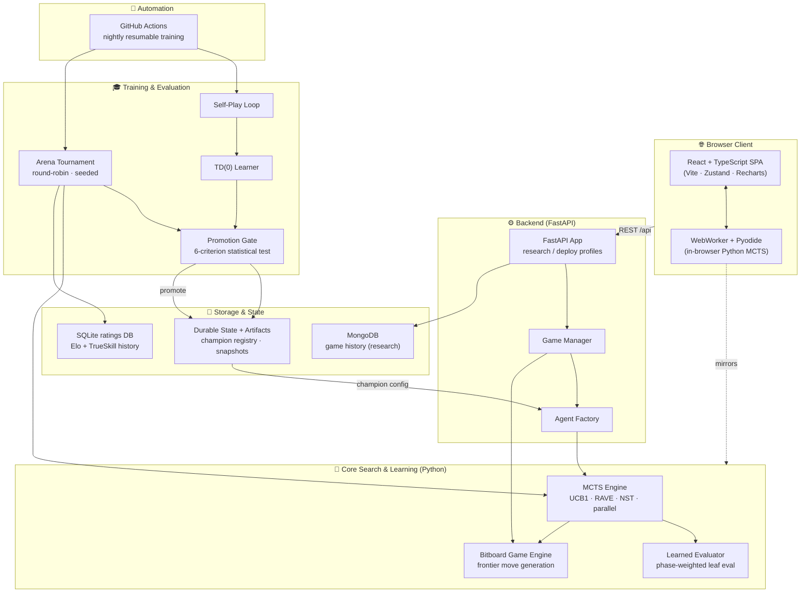
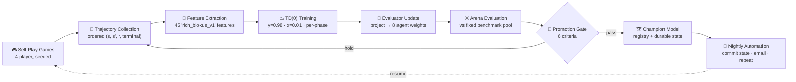
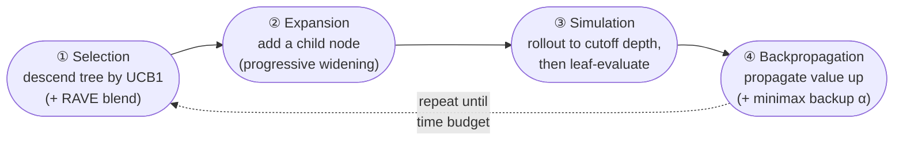
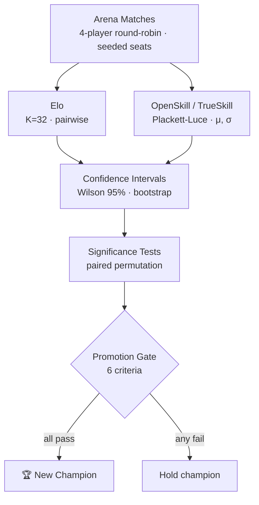
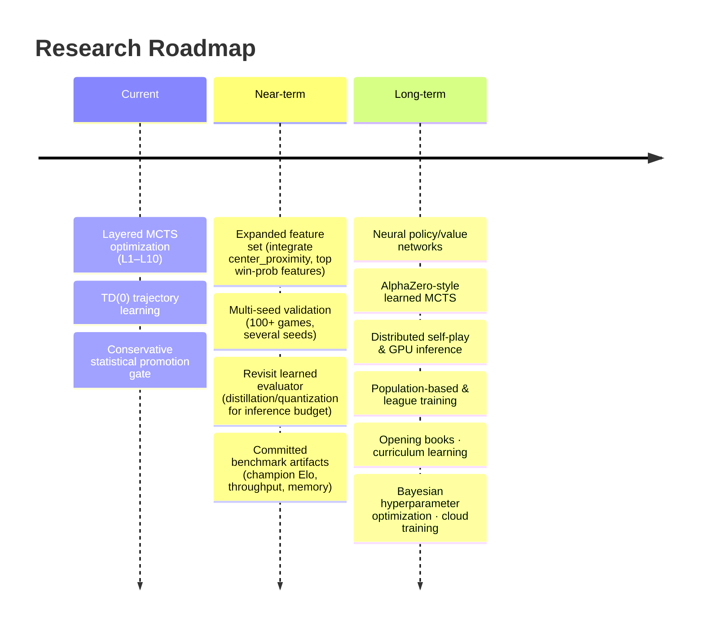

<div align="center">

# 🧪 MCTS Laboratory

### A research platform for developing, training, evaluating, and benchmarking Monte Carlo Tree Search agents for 4‑player Blokus using modern AI techniques.

*Not just a Blokus engine — a full search & reinforcement-learning research stack: a bitboard game engine, a configurable 10-layer MCTS agent, temporal-difference value learning, a statistically-rigorous arena, an automated nightly training pipeline, and an in-browser visualization frontend.*

<br/>

[](https://www.python.org/)
[](https://www.typescriptlang.org/)
[](https://react.dev/)
[](https://fastapi.tiangolo.com/)
[](https://pyodide.org/)
[](https://vercel.com/)

[](https://github.com/tgalloway1/mcts_laboratory/actions/workflows/nightly-mcts-training.yml)

%20%7C%20Self--Play-orange)


<br/>

**[📊 Key Findings](KEY_FINDINGS.md)** · **[🏛️ Architecture](#-system-architecture)** · **[🎓 Training Pipeline](#-training-pipeline)** · **[⚔️ Evaluation](#-evaluation-methodology)** · **[🚀 Quick Start](#-getting-started)** · **[📚 Docs](docs/00-overview/DOCUMENTATION_INDEX.md)**

<br/>


</div>

---

## ❓ What problem does this repository solve?

> **Can a well-tuned evaluation function beat brute-force search?**

This project answers that question empirically. It is a systematic, layered optimization program for Monte Carlo Tree Search in **4-player Blokus** — a game with a branching factor in the *hundreds* and adversarial multi-agent dynamics that make it a hard, under-explored testbed for search and reinforcement learning.

Using regression and temporal-difference learning over **700+ self-play games** and **13,000+ labeled game states**, the project discovered that the hand-tuned evaluation had a **wrong-sign weight** and **3× underweighted opponent denial**. Fixing these with ML-calibrated weights lets an agent with just **25 MCTS iterations beat one running 1,000 iterations** of the default evaluation.

<table>
<tr>
<td align="center" width="33%">

### 🎯 The Headline Result
**Rollout quality dominates iteration quantity.**<br/>
Calibrated weights + shallow rollouts (depth 5, 25 iters) beat 1,000 iterations of pure static eval: **54% vs 0%** win rate.

</td>
<td align="center" width="33%">

### 🔬 The Method
**10 layers** of search enhancements, each validated in a reproducible arena with TrueSkill, Wilson CIs, and permutation tests — *honest negative results included.*

</td>
<td align="center" width="33%">

### 🏗️ The Platform
A production-grade stack: bitboard engine, configurable MCTS, TD learning, automated nightly training, and an in-browser React + Pyodide frontend.

</td>
</tr>
</table>

---

## 💡 Why This Project Is Technically Interesting

This repository demonstrates depth across **search algorithms, reinforcement learning, statistics, distributed automation, and full-stack engineering** — not a toy implementation of any single one.

| Capability | Why It Matters | Technologies |
|---|---|---|
| **Monte Carlo Tree Search** | Full UCB1 tree search with selection/expansion/simulation/backprop, transposition tables, and tree reuse | `numpy`, custom bitboard engine |
| **RAVE & History Heuristics** | Rapid Action Value Estimation (k=1000) gives a measured **4× convergence speedup**; NST rollout biasing | All-Moves-As-First, N-gram selection |
| **Temporal-Difference Learning** | TD(0) value learning over game *trajectories* with phase-specific models and credit assignment over time | semi-gradient TD, L2 regularization |
| **Learned Evaluation Functions** | Regression + Random Forest on self-play states (RF R²=0.535) replaces hand-tuned heuristics | `scikit-learn`, SHAP, bootstrap CIs |
| **Self-Play Pipeline** | Durable, resumable trajectory collection feeding the learner | `pandas`, `pyarrow`, CSV/Parquet stores |
| **Statistical Evaluation** | Win rates with Wilson score intervals, bootstrap CIs, paired permutation tests — *not raw win counts* | `scipy`, custom statistics module |
| **Rating Systems** | OpenSkill (Plackett-Luce) **and** Elo, with conservative μ−3σ leaderboards persisted in SQLite | `openskill`, `sqlite3` |
| **Parallel Simulation** | Root-parallel multiprocessing delivers **3.1× throughput**; tree-parallel with virtual loss benchmarked | `multiprocessing`, virtual loss |
| **Game Engine Design** | Bitboard + frontier-based move generation doing thousands of simulations/second | `numpy`, `numba` |
| **Training Automation** | GitHub Actions runs a resumable nightly gauntlet every 6h with a statistical promotion gate | GitHub Actions, durable state |
| **Reproducibility** | Deterministic per-game seeding, immutable run artifacts, versioned feature sets | seeded RNG, run manifests |
| **In-Browser AI (Pyodide)** | The Python MCTS engine runs *client-side* in a WebWorker — zero-cost, zero-backend gameplay | Pyodide, WebWorkers |
| **FastAPI Backend** | Dual-profile API (research vs. deploy) with MongoDB-backed history & analytics | `fastapi`, `uvicorn`, `motor` |
| **React Visualization** | Interactive board, replay system, search-tree introspection, move heatmaps | React, Zustand, Recharts, Framer Motion |

---

## 🎲 Project Overview

<table>
<tr>
<td width="60%">

### What is Blokus?
Blokus is a 4-player abstract strategy game on a **20×20 grid**. Each player has **21 polyomino pieces** (monomino through pentominoes). Pieces of the same color may touch only at *corners*, never edges. The goal is to place as many of your squares as possible while denying opponents space.

### Why is it hard for AI?
- **Enormous branching factor** — early-game positions routinely have **hundreds** of legal placements (piece × orientation × anchor).
- **4-player adversarial dynamics** — alliances, king-maker scenarios, and turn-order effects break the clean two-player minimax assumptions.
- **Sparse, delayed reward** — the final score only crystallizes at the end of the game.
- **Phase-dependent strategy** — opening, midgame, and endgame reward completely different evaluation signals (empirically, early-game positions are *near-random* to evaluate; R²≈0.006).

</td>
<td width="40%">

### Why MCTS fits
MCTS handles large, hard-to-evaluate state spaces by **sampling** rather than exhaustively searching. It needs no perfect evaluator — only a rollout policy and a backup rule — and it gracefully trades compute for strength.

### Why learned evaluators help
Pure random rollouts in Blokus are noisy. A **calibrated leaf evaluator** sharpens the value estimate at rollout cutoff, letting shallow searches punch far above their iteration count.

### Where RL fits
**Self-play → trajectory collection → TD(0) value learning → arena validation → promotion.** The system learns its own evaluation weights from games it played against itself, gated by a conservative statistical promotion test.

</td>
</tr>
</table>

> [!NOTE]
> **Agent selection:** Always use `"type": "mcts"` (the full `MCTSAgent` in `mcts/mcts_agent.py`). An earlier `FastMCTSAgent` was **archived** after an audit found it was not a valid tree search (nodes did not represent successor states; rollouts scored heuristically from the root). The arena runner now rejects `fast_mcts`. See [`CLAUDE.md`](CLAUDE.md).

---

## 🏛️ System Architecture



<details>
<summary><b>Component responsibilities</b> (click to expand)</summary>

| Layer | Component | Responsibility | Code |
|---|---|---|---|
| **Web UI** | React SPA | Interactive board, replay, MCTS analysis, dashboards | `frontend/src/` |
| **In-browser AI** | Pyodide WebWorker | Runs the Python MCTS engine client-side, zero backend cost | `browser_python/worker_bridge.py`, `frontend/src/store/blokusWorker.ts` |
| **API** | FastAPI | Dual-profile REST API; gameplay (deploy) + analysis/history/training (research) | `webapi/app.py`, `webapi/routes_*.py` |
| **Agent Factory** | Registry | Constructs agents from configs (mcts, heuristic, random, human, champion) | `agents/registry.py`, `webapi/gameplay_agent_factory.py` |
| **MCTS Engine** | `MCTSAgent` | UCB1 search with RAVE, NST, progressive widening, opponent modeling, parallelization | `mcts/mcts_agent.py` |
| **Evaluator** | Leaf eval | Phase-weighted state evaluation; optional learned win-prob model | `mcts/state_evaluator.py`, `mcts/learned_evaluator.py` |
| **Engine** | Bitboard | 20×20 board, frontier move generation, fast legality & `Board.copy()` | `engine/` |
| **Arena** | Tournament runner | Round-robin, deterministic seeding, structured artifacts, ratings | `analytics/tournament/arena_runner.py`, `scripts/arena.py` |
| **Training** | Pipeline | Self-play, trajectory store, TD learner, candidate approaches | `training/` |
| **Storage** | DBs & state | SQLite ratings, MongoDB history, durable champion registry | `training/ratings_db.py`, `webapi/db/`, `data/` |
| **Automation** | CI | Resumable nightly training + promotion + email summary | `.github/workflows/nightly-mcts-training.yml` |

</details>

---

## 🎓 Training Pipeline

The nightly job is a **controlled approach-comparison framework**: every run generates candidate agents from several learning strategies, evaluates them against a *fixed* benchmark pool with *fixed* seeds, and promotes a candidate **only when it passes a statistical gate** — not because Elo bounced up once.



<details>
<summary><b>Stage-by-stage breakdown</b> (click to expand)</summary>

| Stage | What happens | Key files / parameters |
|---|---|---|
| **Self-play games** | Full 4-player games; per-player decision-point states recorded each ply | `training/td_selfplay.py` |
| **Trajectory collection** | Ordered `(state → next_state, reward, terminal)` transitions; sparse reward (0 until terminal) | `training/trajectory_store.py` → `data/td_trajectories.csv` |
| **Feature extraction** | 45 versioned features (`rich_blokus_v1`): mobility, corners, piece inventory, territory, score-race | `training/rich_features.py` |
| **TD training** | Semi-gradient TD(0): `V(s)=w·f(s)+b`, target `r + γ·V(s′)`, clipped error, L2; **3 independent phase models** | `training/td_learning.py` — γ=0.98, α=0.01, 10 epochs, L2=0.001, clip ±2.0 |
| **Evaluator update** | Project 45-dim rich weights → 8 agent features, rescale to `WEIGHT_SCALE=0.30` | `project_to_agent_weights()` |
| **Arena evaluation** | Candidate vs fixed pool (`heuristic`, `random`, `best_historical`) at seeds `[20260101, 20260202]` | `training/evaluation/benchmark_pool.py` |
| **Promotion gate** | 6-criterion conservative test (see [Evaluation](#-evaluation-methodology)) | `training/evaluation/promotion_gate.py` |
| **Champion model** | On pass: update `data/champion_registry.json` + durable `training/state/latest.json` | `mcts/champion_profile.py` |
| **Nightly automation** | Resumable, commits state back to repo, emails summary on success **or** failure | `training/nightly_run.py`, GitHub Actions (every 6h, 350-min cap) |

**Candidate-generation approaches** compared each run: `td` (TD learning), `mcts_sweep` (exploration-constant grid), `heuristic_tune` (regression refit), `baseline` (stronger search seed), and `hybrid` (TD + regression blend).

</details>

---

## 🌳 Search Algorithm

Each MCTS move executes thousands of four-phase iterations:



| Mechanism | Implementation | Notes |
|---|---|---|
| **UCT / UCB1** | `Q + C·√(ln N / n)`, `C=1.414` default | Adaptive-C variant available (Layer 9) |
| **Exploration vs exploitation** | Balanced by `exploration_constant`; sufficiency-threshold mode can switch to pure exploitation after warmup | Layer 9 meta-optimization |
| **RAVE blending** | β = √(k / (3N + k)), `rave_k=1000` | **4× convergence speedup**; AMAF statistics |
| **Tree reuse** | Transposition table keyed by Zobrist hash | `mcts/zobrist.py`, `use_transposition_table` |
| **Evaluation caching** | Per-state feature memoization in leaf eval | `FeatureCache` in `training/rich_features.py` |
| **Progressive widening** | `pw_c=2.0`, `pw_alpha=0.5` — limits children by visit count | Tames the huge branching factor (Layer 3) |
| **Rollout policy** | `random` (recommended), `heuristic`, or `two_ply`; cutoff at depth 5 then static eval | Layer 4 — *random + cutoff 5 is optimal* |
| **Minimax backup** | Blends averaging with minimax value, `minimax_backup_alpha=0.25` | Improves backup when rollouts present |

---

## 🧠 Learning Algorithms

The repo implements a *ladder* of approaches, from zero-learning baselines to trajectory-based value learning — and documents where each one **wins and loses**.

| Approach | Purpose | Advantages | Trade-offs |
|---|---|---|---|
| **Pure MCTS** | Baseline tree search, no learned signal | Simple, unbiased, strong with enough compute | Random rollouts are noisy; iteration-hungry |
| **Heuristic evaluation** | Hand-tuned leaf eval | Fast, interpretable | Mis-calibrated by hand (wrong-sign weight found!) |
| **Learned evaluator (regression/RF)** | Fit weights to final score over 13K states | RF R²=0.535; **76% win rate** vs defaults | Linear R² only 0.136; GBT inference too slow (~26ms) |
| **TD(0) learning** | Bootstrap value over trajectories with credit assignment | Per-phase models; uses temporal structure | Linear value model; needs ≥200 rows/phase |
| **Candidate evaluation** | Generate competing agents per nightly run | Compares strategies head-to-head | Costs arena compute per candidate |
| **Self-play** | Generate training data from the agent's own games | No human data needed; on-distribution | Can reinforce its own blind spots |
| **Arena tournaments** | Validate strength under a statistical gate | Robust, reproducible promotion | Slower than naive win-rate checks |

> [!TIP]
> See [`KEY_FINDINGS.md`](KEY_FINDINGS.md) and [`docs/TD_LEARNING.md`](docs/TD_LEARNING.md) for the full experimental write-up, including phase-dependent weights (a documented **failure**, 0% win rate) and the regression-vs-TD comparison.

---

## ⚔️ Evaluation Methodology

Agents are never compared by raw win counts. Every comparison runs through a reproducible arena and a battery of statistical tests.



| Method | Detail | Where |
|---|---|---|
| **Arena format** | 4-player, round-robin or seeded-randomized seats; deterministic per-game seeds from `run_seed + index` | `analytics/tournament/arena_runner.py` |
| **Elo** | Classical, K=32, default 1200, computed over all pairwise matchups | `analytics/tournament/elo.py` |
| **OpenSkill / TrueSkill** | Plackett-Luce model (μ=25, σ=8.33, β=12.5, τ=0.25); leaderboard uses conservative **μ−3σ** | `analytics/tournament/trueskill_rating.py` |
| **Confidence intervals** | **Wilson score** (95%) for win rates; **bootstrap** (10,000 resamples) for score margins | `analytics/tournament/statistics.py` |
| **Significance** | **Paired permutation test** on head-to-head deltas; noise-floor estimation from recent run tail | `statistics.py`, `training/evaluation/rating_analysis.py` |
| **Promotion thresholds** | #1 in conservative TrueSkill, beats runner-up >50%, Δμ ≥ 0.5, Wilson CI clear of champion, ≥2 seeds, ≥40 games | `training/evaluation/promotion_gate.py` |
| **Persistence** | Append-only SQLite (`rating_history`, `run_summary`, `game_elo`) seeds the next run | `training/ratings_db.py` |

**Why this beats simple win rate:** a 60% win rate over 10 games is statistically indistinguishable from 50%. Wilson intervals quantify that uncertainty, permutation tests assign p-values to deltas, and the multi-seed gate prevents promoting agents that merely got a lucky seed.

---

## 📊 Benchmark Results

### Headline experimental findings (from [`KEY_FINDINGS.md`](KEY_FINDINGS.md))

| Layer | Technique | Result |
|---|---|---|
| **L3** | Progressive widening | **+64% win rate**, mean score 92.4 vs 76.0 |
| **L4** | Random rollout + cutoff depth 5 | Beats every alternative; **10× faster** than two-ply; cutoff-5 @ 25 iter beats cutoff-0 @ 1000 iter |
| **L5** | RAVE k=1000 | **4× convergence speedup**; 44.7% win rate vs 14.7% baseline; 50ms RAVE > 200ms vanilla |
| **L6** | ML-calibrated weights | **76% win rate** vs 12% for defaults; phase-dependent weights *failed* (0%) |
| **L8** | Root parallelization (2 workers) | **46% win rate** (TrueSkill #1); **3.1× throughput** at 4 workers; tree-parallel <10% (GIL) |
| **L9** | Adaptive rollout depth | **36% win rate** (#1), **1.64× faster**; adaptive exploration *harmful* (8%) |

### ML pipeline

```
700 self-play games → 13,332 labeled states
   → Linear regression  (R² = 0.136,  7 features)
   → Random Forest      (R² = 0.535, 34 features)
      → Calibrated weight vector → 76% arena win rate vs hand-tuned baseline
```

### Engine & throughput (from `benchmarks/results/`)

| Metric | Value | Source |
|---|---|---|
| Self-play throughput (stage 2) | 2.04 steps/s · 491 ms/step | `benchmarks/results/selfplay_league_bench_*` |
| Self-play throughput (stage 3) | 1.86 steps/s · 538 ms/step | `benchmarks/results/stage3_env_scan_*` |
| Champion search throughput | ~64 iterations/s @ 500ms budget (~250 iters/move) | `arena_runs/20260510_133320_002f9dab` |
| Root parallel speedup | 1.84× (2 workers) · 3.13× (4 workers) on 4 cores | Layer 8 report |

<div align="center">


</div>

> [!WARNING]
> **Benchmarks needing a fresh, reproducible run (TODO).** Several portfolio-grade metrics are not yet computed into a committed artifact. Recommended additions:
> - **Current champion Elo / TrueSkill** — query `training/ratings_db.py::last_run_summary()` and render to a committed JSON/badge.
> - **Promotion frequency over time** — aggregate the `rating_history` SQLite table into a CSV + plot.
> - **Nodes searched / rollouts-per-second by config** — extend `scripts/profile_mcts.py` to emit a standard JSON benchmark.
> - **Memory footprint per search** — add a memory probe to `scripts/profile_mcts.py`.
> - **Nightly end-to-end runtime** — surface from GitHub Actions run metadata.
>
> Each is *mechanically derivable* from existing data; they are flagged TODO rather than estimated to avoid fabricated numbers.

---

## 📈 Research Dashboard

The frontend surfaces deep search introspection. *(Live screenshots/GIFs recommended — see [Recommended Assets](#-recommended-assets-to-elevate-further); placeholders below map to existing components.)*

| View | What it shows | Component |
|---|---|---|
| **Board exploration heatmap** | Which 20×20 regions MCTS searched | `frontend/src/components/mcts-viz/BoardExplorationHeatmap.tsx` |
| **Exploration vs exploitation** | Time-series of the UCB1 balance | `ExplorationExploitationChart.tsx` |
| **Root policy distribution** | Visit counts across candidate moves | `RootPolicyChart.tsx` |
| **Depth / breadth over time** | How the tree grows during a move | `DepthOverTimeChart.tsx`, `BreadthOverTimeChart.tsx` |
| **Rollout histogram & UCT breakdown** | Rollout value spread; per-term UCB1 decomposition | `RolloutHistogram.tsx`, `UctBreakdownChart.tsx` |
| **Move-delta & strategy-mix telemetry** | Per-move impact, opponent suppression, strategy radar | `frontend/src/components/telemetry/` |
| **Replay viewer** | Move-by-move, fully reproducible from JSON | `AnalysisDashboard.tsx`, `Analysis.tsx` |
| **Champion Elo trajectory** | Per-game Elo over nightly runs | `training/elo_plot.py` → committed PNG |

---

## 🗂️ Repository Structure

```
MCTS_Laboratory/
├── engine/                 # ⚡ Bitboard Blokus engine — 20×20 board, frontier move generation,
│                           #    fast legality checks, Board.copy() optimization, telemetry
├── mcts/                   # 🧠 The MCTS agent and all 10 layers of enhancements
│   ├── mcts_agent.py       #    Full search: UCB1, RAVE, NST, progressive widening, parallel, adaptive
│   ├── parallel.py         #    Root parallelization (multiprocessing) + tree (virtual loss)
│   ├── opponent_model.py   #    Alliance detection, king-maker awareness (Layer 7)
│   ├── state_evaluator.py  #    Phase-dependent leaf evaluation (Layers 4, 6)
│   ├── learned_evaluator.py#    Optional learned win-probability model
│   ├── rich_leaf_evaluator.py # Tiered-cost leaf features
│   ├── zobrist.py          #    Zobrist hashing for transposition tables
│   └── search_trace.py     #    Per-iteration introspection for the frontend
├── agents/                 # 🤖 Agent roster: heuristic, random, human adapters, champion, registry
├── training/               # 🎓 Learning pipeline
│   ├── td_selfplay.py      #    Self-play trajectory collection
│   ├── td_learning.py      #    TD(0) value learner (per-phase)
│   ├── rich_features.py    #    45-feature 'rich_blokus_v1' extractor
│   ├── trajectory_store.py #    Durable trajectory CSV schema/IO
│   ├── nightly_run.py      #    Resumable nightly orchestration
│   ├── ratings_db.py       #    Append-only SQLite ratings history
│   ├── approaches/         #    Candidate generators (td, baseline, sweep, heuristic, hybrid)
│   └── evaluation/         #    Promotion gate, benchmark pool, head-to-head, reports
├── analytics/              # 📊 Tournament, ratings (Elo/OpenSkill), statistics, heatmaps, win-prob
│   └── tournament/         #    arena_runner.py, elo.py, trueskill_rating.py, statistics.py
├── scripts/                # 🛠️ Arena CLI + 35+ arena configs, profilers, data collection, visualizers
│   ├── arena.py            #    Tournament entry point
│   └── arena_config*.json  #    Per-layer experiment configurations
├── webapi/                 # 🌐 FastAPI app — research & deploy profiles, MongoDB, agent factory
├── api-runtime/            # ▲ Vercel serverless entry point (deploy profile)
├── browser_python/         # 🐍 Pyodide mirror of engine+mcts; worker_bridge for in-browser play
├── frontend/               # ⚛️ React + TypeScript + Vite SPA (board, replay, MCTS analysis, dashboards)
├── benchmarks/             # ⏱️ Performance benchmarks (move-gen, self-play league, env scans)
├── schemas/                # 📐 Pydantic data models (game state, moves)
├── config/                 # ⚙️ Agent configs, champion params, key-findings best params
├── data/                   # 💾 Calibrated weights, champion registry, snapshots, trajectories
├── arena_runs/             # 📁 Timestamped arena artifacts (games.jsonl, summary.json, snapshots)
├── arena_visuals/          # 🖼️ Layer-progression plots embedded in this README
├── tests/                  # ✅ 72 test files, 659 test functions
├── docs/                   # 📚 Structured, status-labeled documentation system
└── archive/                # 🗄️ Archived RL agents, FastMCTSAgent, historical layer reports
```

---

## ✨ Technical Highlights

<table>
<tr>
<td width="50%">

- 🎲 **Deterministic simulations** — per-game seeds derived from run seed + index
- 🔁 **Reproducible experiments** — immutable run artifacts, versioned feature sets
- 🧩 **Modular agent architecture** — registry-driven, config-instantiated agents
- 🔌 **Pluggable evaluation functions** — heuristic, calibrated, learned, TD
- 🐍 **Browser execution via Pyodide** — Python MCTS runs in a WebWorker, no backend

</td>
<td width="50%">

- 🤖 **Automated nightly training** — resumable, durable, self-committing CI
- 📏 **Continuous benchmarking** — arena throughput + engine micro-benchmarks
- 📊 **Statistical validation** — Wilson CIs, bootstrap, permutation tests
- 🏷️ **Experiment versioning** — champion registry with promotion provenance
- ⚙️ **Parallel execution** — root multiprocessing, 3.1× measured throughput

</td>
</tr>
</table>

---

## 📐 Engineering Metrics

| Metric | Value |
|---|---|
| Python source files (excl. archive) | **297** |
| Python lines of code (excl. archive) | **~64,600** |
| Test files / test functions | **72 / 659** |
| Frontend TS/TSX files | **96** |
| MCTS enhancement layers | **10** (Layers 1–10) |
| Candidate-generation approaches | **5** (td, mcts_sweep, heuristic_tune, baseline, hybrid) |
| Agent implementations | **5+** (mcts, heuristic, random, human, champion) |
| Rating systems | **2** (Elo + OpenSkill/Plackett-Luce) |
| Arena experiment configs | **35+** |
| GitHub Actions workflows | **1** (nightly resumable training) |
| Documentation files (`docs/`) | **99** markdown files |
| Self-play games analyzed | **700+** |
| Labeled game states | **13,332** |
| Rich feature set size | **45** (`rich_blokus_v1`) |

> Counts generated from the repository at documentation time; see the [Benchmarks TODO](#-benchmark-results) for runtime/coverage metrics that require a fresh run.

---

## 🚀 Getting Started

### Prerequisites
**Python** 3.9+ · **Node.js** 16+

### Installation

```bash
# 1. Install the Python package + dev tooling
pip install -e ".[dev]"          # or: pip install -r requirements.txt

# 2. Install frontend dependencies
cd frontend && npm install && cd ..

# 3. Copy the env file (MongoDB only needed for the research profile)
cp .env.example .env
```

### Run locally

```bash
# Backend (research profile, full route surface) → http://localhost:8000
python run_server.py

# Frontend (separate terminal) → http://localhost:5173
cd frontend && npm run dev
```

### Run an arena tournament

```bash
# Standard arena run
python scripts/arena.py --config scripts/arena_config.json

# Smoke test (reduced game count)
python scripts/arena.py --config scripts/arena_config_extended_rollout.json --num-games 4

# A layered experiment (e.g. Layer 5 RAVE sweep)
python scripts/arena.py --config scripts/arena_config_layer5_rave_k_sweep.json --verbose
```

### Train & evaluate

```bash
# Compare candidate-generation approaches under a wall-clock budget (nightly default)
python -m training.nightly_run --approaches td,mcts_sweep,heuristic_tune,baseline \
    --games 100 --time-budget-minutes 45

# Train a TD(0) evaluator from collected trajectories
python -m training.td_learning --input data/td_trajectories.csv \
    --output training/state/td_evaluator_weights.json
```

### Run benchmarks & view results

```bash
pytest tests/                                   # full test suite
python scripts/profile_mcts.py                  # search profiler
python benchmarks/benchmark_move_generation.py  # engine micro-benchmark
```

> The in-browser **Pyodide** bundle (for zero-backend gameplay) and the **Vercel** deploy profile are documented in [`docs/deployment.md`](docs/deployment.md). Build the browser core with `scripts/build_browser_core.sh`.

---

## 🧑‍💻 Development Workflow

| Task | How |
|---|---|
| **Add a new agent** | Implement the `agents/interface.py` protocol, register in `agents/registry.py`, expose a config |
| **Create an evaluator** | Add features to `mcts/state_evaluator.py` / `training/rich_features.py`; wire weights |
| **Implement a learning algorithm** | Add a `Candidate` generator under `training/approaches/` following `base.py` |
| **Add a benchmark** | Drop a script in `benchmarks/`; emit JSON to `benchmarks/results/` |
| **Write an experiment** | Author an `arena_config_*.json`, run via `scripts/arena.py`, artifacts land in `arena_runs/` |
| **Test changes** | `pytest tests/` (659 tests); lint with `ruff`, type-check with `mypy` (strict config in `pyproject.toml`) |

> [!IMPORTANT]
> When changing functionality, update [`FEATURES.md`](FEATURES.md) and the affected `docs/` files in the **same commit**, using the status labels (`Implemented | Partial | Stubbed | Broken | Designed only | Deprecated | Unknown`). See [`CLAUDE.md`](CLAUDE.md) and [`docs/07-ai-context/AGENT_WORKFLOW.md`](docs/07-ai-context/AGENT_WORKFLOW.md).

---

## 🔭 Future Research



> [!NOTE]
> **What this project is *not* (yet):** it is not an AlphaZero-style *learned* MCTS — there is no neural policy/value network driving selection or rollouts. Parallelization is single-machine (numbers gathered on 4 cores). Everything is Blokus-specific from the bitboard up. These are the natural next frontiers above.

---

## 📚 Documentation

Full documentation lives under [`docs/`](docs/) as a numbered, status-labeled system for humans and AI agents.

| Topic | Entry point |
|---|---|
| 🗺️ **Documentation index** | [`docs/00-overview/DOCUMENTATION_INDEX.md`](docs/00-overview/DOCUMENTATION_INDEX.md) |
| 🏛️ **Architecture** | [`docs/02-architecture/ARCHITECTURE.md`](docs/02-architecture/ARCHITECTURE.md) |
| 🧮 **Algorithms / MCTS analysis** | [`docs/mcts-analysis-mode/`](docs/mcts-analysis-mode/) |
| 🎓 **Training** | [`docs/TD_LEARNING.md`](docs/TD_LEARNING.md), [`training/README.md`](training/README.md), [`docs/training_workflows.md`](docs/training_workflows.md) |
| ⚔️ **Evaluation / Arena** | [`docs/arena.md`](docs/arena.md), [`docs/CHAMPION_GAUNTLET.md`](docs/CHAMPION_GAUNTLET.md) |
| 📊 **Datasets & metrics** | [`docs/datasets.md`](docs/datasets.md), [`docs/metrics/`](docs/metrics/) |
| 🌐 **Deployment** | [`docs/deployment.md`](docs/deployment.md), [`docs/VERCEL_DEPLOYMENT_AUDIT.md`](docs/VERCEL_DEPLOYMENT_AUDIT.md) |
| 🔬 **Key findings** | [`KEY_FINDINGS.md`](KEY_FINDINGS.md) |
| 🤖 **For AI agents** | [`CLAUDE.md`](CLAUDE.md), [`docs/07-ai-context/`](docs/07-ai-context/) |

---

## 🤝 Contributing

Contributions are welcome. To keep the research reproducible and the platform trustworthy:

- **Coding standards** — `ruff` (lint/format) and `mypy` strict mode; match surrounding idioms. Config in [`pyproject.toml`](pyproject.toml).
- **Testing** — add/extend tests under `tests/`; the suite has **659** tests and must stay green (`pytest tests/`).
- **Reproducibility** — new experiments ship with a committed `arena_config_*.json` and seeds; never hand-edit run artifacts.
- **Documentation** — update [`FEATURES.md`](FEATURES.md) and the relevant `docs/` page in the same PR, with the correct status label.
- **Benchmarks** — performance-affecting changes include a before/after benchmark from `benchmarks/` or `scripts/profile_mcts.py`.

---

<details>
<summary><h3>🎨 Recommended Assets to Elevate Further</h3></summary>

These assets would push the repository from "excellent" to "conference-grade." All are derivable from existing code/data:

- **Animated search-tree visualization** — record the existing `search_trace.py` data as an animated GIF of tree growth during one move.
- **Training progression GIF** — animate `training/elo_plot.py` output across nightly runs.
- **Interactive replay examples** — embed a hosted link to the `Analysis.tsx` replay viewer with a sample game.
- **Search-tree explorer** — a standalone D3/React view over `arena_runs/*/games.jsonl`.
- **Arena dashboard** — a hosted leaderboard reading `summary.json` across `arena_runs/`.
- **Elo history plot** — committed PNG from the `rating_history` SQLite table.
- **TD loss curves** — plot `training_metrics.td_loss_by_phase` over runs.
- **Agent comparison tables** — auto-generated head-to-head matrices from `analytics/tournament`.
- **Architecture illustration** — a polished SVG of the [System Architecture](#-system-architecture) Mermaid diagram.
- **Benchmark dashboard** — aggregate `benchmarks/results/*.json` into a tracked HTML report.
- **Research-style figures** — publication-ready versions of the `arena_visuals/` plots (vector, captioned).

</details>

---

<div align="center">

**Built with** Python · MCTS · Reinforcement Learning · FastAPI · React · Pyodide

*A demonstration of advanced AI search, reinforcement learning, statistical evaluation, and production-quality engineering.*

**[⬆ Back to top](#-mcts-laboratory)**

</div>
