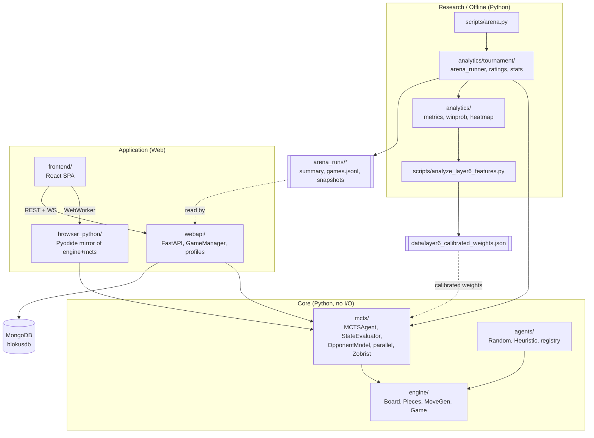

# System Map

> Module relationships at a glance. Last audited: 2026-05-28.
> Narrative: [Architecture](ARCHITECTURE.md). More diagrams: [Flow Diagrams](../08-visuals/FLOW_DIAGRAMS.md).



## Reading the map

- **Core** has no I/O and no web dependencies; everything depends on `engine/`.
- **Research/Offline** runs tournaments and the calibration feedback loop that
  produces `data/layer6_calibrated_weights.json`, which feeds back into the
  evaluator (dashed arrow).
- **Application** exposes the same core two ways: in-browser via the Pyodide
  mirror (`browser_python/`) and server-side via FastAPI.
- **MongoDB** persists games/analysis (research profile only); arena artifacts
  live on the filesystem and are read back by the API for the dashboards.

## Dependency direction (who imports whom)

```
engine  ←  mcts  ←  agents
   ↑         ↑         ↑
   └──── analytics, webapi, browser_python, scripts
```

No module in `Core` imports from `webapi/`, `frontend/`, or `analytics/`.
