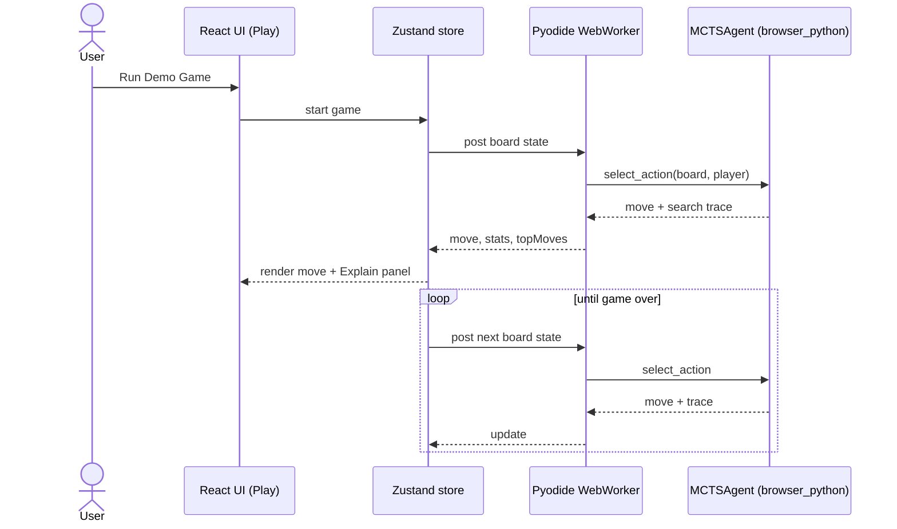
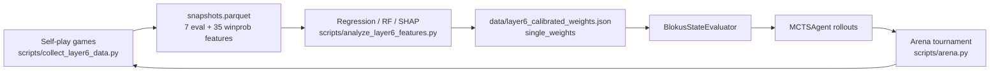

# Flow Diagrams

> Visual flows for core paths. Last audited: 2026-05-28.
> System module map: [System Map](../02-architecture/SYSTEM_MAP.md).
> Existing publication plots: `arena_visuals/*.png` (embedded in the root README).

## Browser gameplay (in-browser MCTS)

## Evaluation calibration loop

## Arena experiment flow

See the offline subgraph in [System Map](../02-architecture/SYSTEM_MAP.md):
`scripts/arena.py` → `arena_runner.run_arena` → `build_agent` per player →
round-robin games → `arena_runs/<ts>_<id>/` artifacts → read by `/api/arena-runs`
for the Benchmark/Layer-Progression dashboards.

## Existing result visuals

The layer-progression story is already rendered as static plots:
`arena_visuals/01_layer_progression.png`, `03_L4_quality_vs_quantity.png`,
`05_L5_rave_convergence.png`, `09_grand_summary.png` (generated by
`scripts/generate_arena_visuals.py`).
